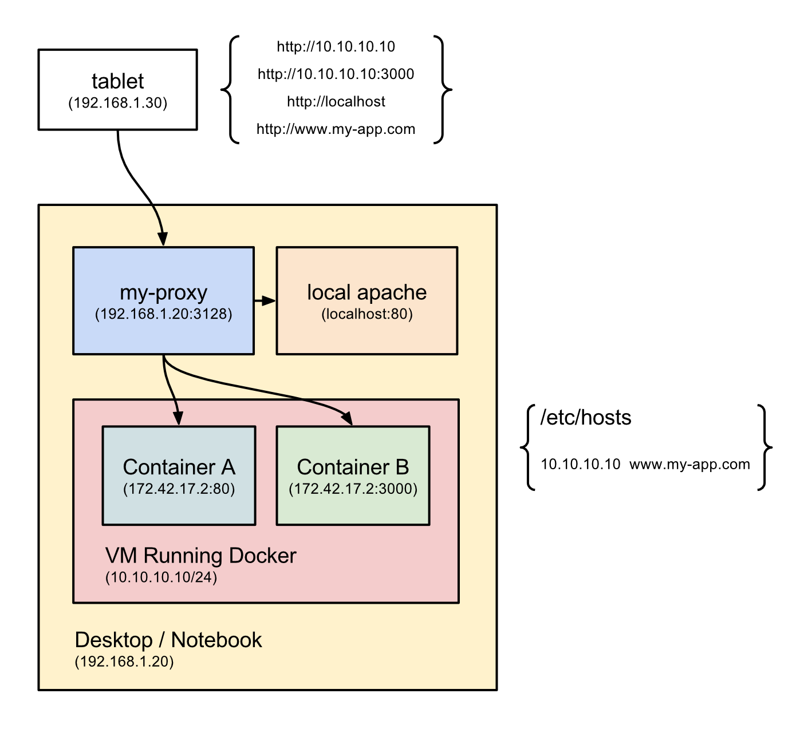

# my-proxy

my-proxy is an HTTP(S) Proxy that enables a developer to access internal networks (localhost, VMs, Docker containers) from external devices as they were in the host computer.

Read [How to access docker containers from external devices](http://nunes.io/blog/how-to-access-docker-containers-from-external-devices/) for more information.




## install instructions
```bash
npm install -g my-proxy
```


## usage
```bash
  Usage: my-proxy [options]

  Options:

    -h, --help         output usage information
    -V, --version      output the version number
    -b, --bind [host]  bind to host [0.0.0.0]
    -p, --port [port]  listen on port [3128]
    -v, --verbose      verbose mode
    -q, --quiet        quiet mode
```


### example
```bash
my-proxy
# HTTP(S) Proxy Server listening for connections on host [0.0.0.0] port [3128]
```


## todo
- [ ] add proxy authentication
- [ ] filter requests (something similar to tcpdump)
- [ ] simulate mobile networking conditions (Edge, 3G and even offline)


## i know nothing about networking
In case you know nothing about networking, a very simple definition of a use case for this project is:
1. You run this app on your computer;
2. You set up your device (or another computer) pointing to this computer IP address, port 3128 (default one);
3. From now on you can access any url from your device as you were on your computer, `localhost` or any other internal url is going to work;


## setting up proxy
- chrome: https://support.google.com/chrome/answer/96815?hl=en
- firefox: https://support.mozilla.org/en-US/kb/advanced-panel-accessibility-browsing-network-upda#w_network-tab
- mac os x: https://www.youtube.com/watch?v=decI0qEamdg
- iOS: http://www.amsys.co.uk/2012/blog/how-to-setup-proxy-servers-in-ios/#.VUDBrWRVhBc
- android: http://stackoverflow.com/questions/21068905/how-to-change-proxy-settings-in-android-especially-in-chrome
- internet explorer: http://windows.microsoft.com/en-us/windows/change-internet-explorer-proxy-server-settings#1TC=windows-7
